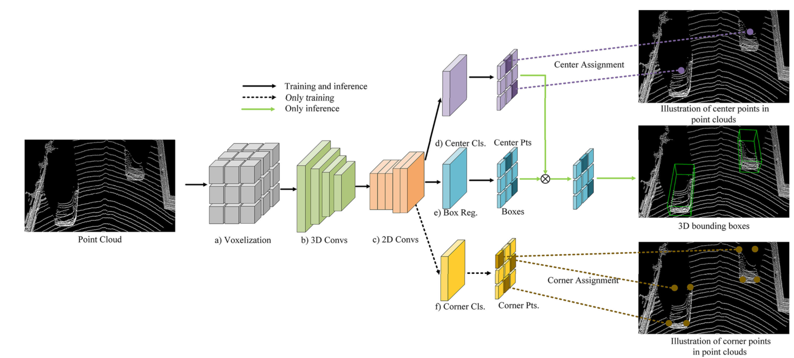
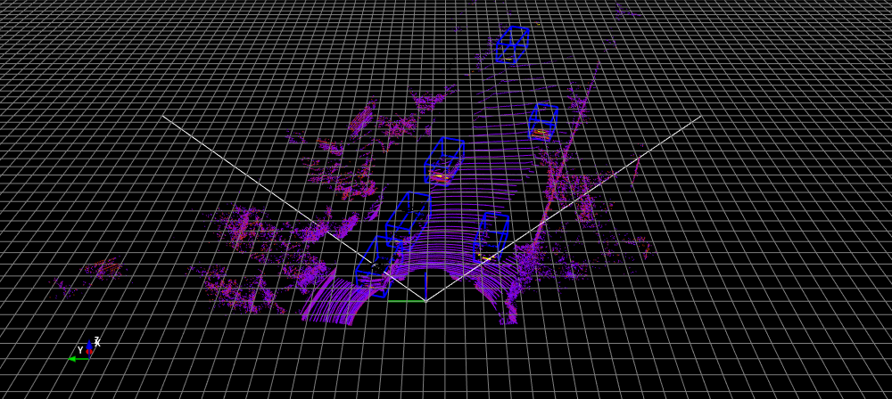

# CenterNet3D-PyTorch

[![python-image]][python-url]
[![pytorch-image]][pytorch-url]

The PyTorch Implementation of the paper: 
[CenterNet3D: An Anchor free Object Detector for Autonomous Driving](https://arxiv.org/pdf/2007.07214.pdf)

---

## Features
- [x] LiDAR-based realtime 3D object detection
- [x] Support [distributed data parallel training](https://github.com/pytorch/examples/tree/master/distributed/ddp)
- [ ] Release pre-trained models 

## 2. Getting Started
### 2.1. Requirement

```shell script
pip install -U -r requirements.txt
```

- For [`mayavi`](https://docs.enthought.com/mayavi/mayavi/installation.html) library, please refer to the installation instructions from its official website.

- To build the `CenterNet3D` model, I have used the [spconv](https://github.com/traveller59/spconv) library. Please follow the 
instruction from the repo to install the library. I also wrote notes for the installation [here](./INSTALL_spconv.md)

### 2.2. Data Preparation
Download the 3D KITTI detection dataset from [here](http://www.cvlibs.net/datasets/kitti/eval_object.php?obj_benchmark=3d).

The downloaded data includes:

- Velodyne point clouds _**(29 GB)**_
- Training labels of object data set _**(5 MB)**_
- Camera calibration matrices of object data set _**(16 MB)**_
- **Left color images** of object data set _**(12 GB)**_


Please make sure that you construct the source code & dataset directories structure as below.

### 2.3. CenterNet3D architecture





### 2.4. How to run

#### 2.4.1. Visualize the dataset 

```shell script
cd src/data_process
```

- To visualize 3D point clouds with 3D boxes, let's execute:

```shell script
python kitti_dataset.py
```


*An example of the KITTI dataset:*



#### 2.4.2. Inference

```
python test.py --gpu_idx 0 --peak_thresh 0.2
```


#### 2.4.4. Training

##### 2.4.4.1. Single machine, single gpu

```shell script
python train.py --gpu_idx 0 --batch_size <N> --num_workers <N>...
```

##### 2.4.4.2. Multi-processing Distributed Data Parallel Training
We should always use the `nccl` backend for multi-processing distributed training since it currently provides the best 
distributed training performance.

- **Single machine (node), multiple GPUs**

```shell script
python train.py --dist-url 'tcp://127.0.0.1:29500' --dist-backend 'nccl' --multiprocessing-distributed --world-size 1 --rank 0
```

- **Two machines (two nodes), multiple GPUs**

_**First machine**_

```shell script
python train.py --dist-url 'tcp://IP_OF_NODE1:FREEPORT' --dist-backend 'nccl' --multiprocessing-distributed --world-size 2 --rank 0
```
_**Second machine**_

```shell script
python train.py --dist-url 'tcp://IP_OF_NODE2:FREEPORT' --dist-backend 'nccl' --multiprocessing-distributed --world-size 2 --rank 1
```

To reproduce the results, you can run the bash shell script

```bash
./train.sh
```


#### Tensorboard

- To track the training progress, go to the `logs/` folder and 

```shell script
cd logs/<saved_fn>/tensorboard/
tensorboard --logdir=./
```

- Then go to [http://localhost:6006/](http://localhost:6006/):


## Contact

If you think this work is useful, please give me a star! <br>
If you find any errors or have any suggestions, please contact me (**Email:** `nguyenmaudung93.kstn@gmail.com`). <br>
Thank you!


## Citation

```bash
@article{CenterNet3D,
  author = {Guojun Wang, Bin Tian, Yunfeng Ai, Tong Xu, Long Chen, Dongpu Cao},
  title = {CenterNet3D: An Anchor free Object Detector for Autonomous Driving},
  year = {2020},
  journal = {arXiv},
}
@misc{CenterNet3D-PyTorch,
  author =       {Nguyen Mau Dung},
  title =        {{CenterNet3D-PyTorch: PyTorch Implementation of the CenterNet3D paper}},
  howpublished = {\url{https://github.com/maudzung/CenterNet3D-PyTorch}},
  year =         {2020}
}
```

## References

[1] CenterNet: [Objects as Points paper](https://arxiv.org/abs/1904.07850), [PyTorch Implementation](https://github.com/xingyizhou/CenterNet)
[2] VoxelNet: [PyTorch Implementation](https://github.com/skyhehe123/VoxelNet-pytorch)

## Folder structure

```
${ROOT}
└── checkpoints/    
    ├── centernet3d.pth
└── dataset/    
    └── kitti/
        ├──ImageSets/
        │   ├── test.txt
        │   ├── train.txt
        │   └── val.txt
        ├── training/
        │   ├── image_2/ (left color camera)
        │   ├── calib/
        │   ├── label_2/
        │   └── velodyne/
        └── testing/  
        │   ├── image_2/ (left color camera)
        │   ├── calib/
        │   └── velodyne/
        └── classes_names.txt
└── src/
    ├── config/
    │   ├── train_config.py
    │   └── kitti_config.py
    ├── data_process/
    │   ├── kitti_dataloader.py
    │   ├── kitti_dataset.py
    │   └── kitti_data_utils.py
    ├── models/
    │   ├── centernet3d.py
    │   ├── deform_conv_v2.py
    │   └── model_utils.py
    └── utils/
    │   ├── evaluation_utils.py
    │   ├── logger.py
    │   ├── misc.py
    │   ├── torch_utils.py
    │   └── train_utils.py
    ├── evaluate.py
    ├── test.py
    ├── train.py
    └── train.sh
├── README.md 
└── requirements.txt
```


[python-image]: https://img.shields.io/badge/Python-3.6-ff69b4.svg
[python-url]: https://www.python.org/
[pytorch-image]: https://img.shields.io/badge/PyTorch-1.5-2BAF2B.svg
[pytorch-url]: https://pytorch.org/